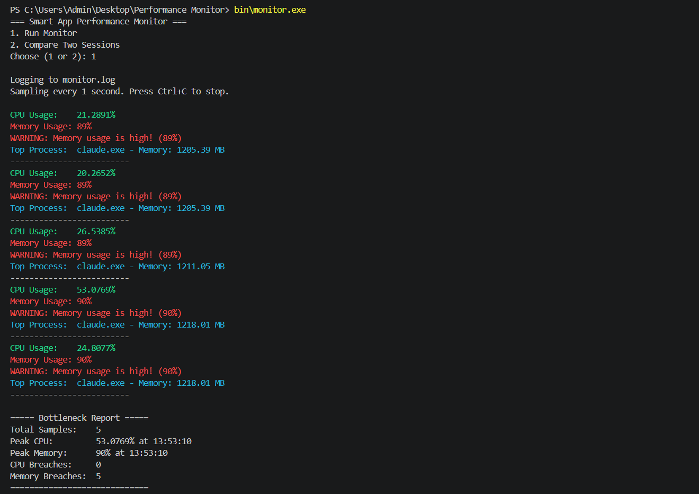
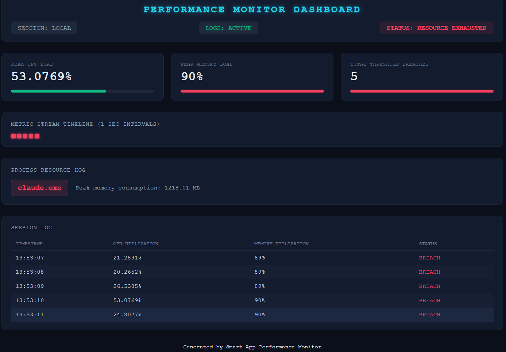

# Smart App Performance Monitor

A C++ tool for Windows that watches CPU and memory usage in real time, flags threshold breaches, identifies the process eating the most memory, and exports a styled HTML dashboard summarizing the session. Built as a hands-on project to learn the Windows API, TCP networking, and SQLite from the ground up.


## Demo

**Console output** — color-coded live readings with warnings and top process:



**HTML dashboard** — exported at the end of each session:



## Features

**Core monitoring**
- Real-time CPU usage (`GetSystemTimes`) and memory usage (`GlobalMemoryStatusEx`), sampled every second
- Configurable threshold alerting (default: CPU > 80%, Memory > 85%)
- Color-coded console output (green / yellow / red) based on how close usage is to the threshold
- Top memory-consuming process tracked every second (`EnumProcesses` + `GetProcessMemoryInfo`)
- Historical logging to a timestamped `.log` file
- Clean shutdown on Ctrl+C — still generates a full report instead of dying mid-run

**Reporting**
- Session comparison mode — load two `.log` files and compare average/peak CPU & memory plus warning counts side by side
- Bottleneck report — peak CPU/memory with timestamps, breach counts, full per-second history, and the single biggest memory hog across the run
- Export to plain `.txt` or a styled `.html` dashboard (status header, color-coded peak/breach cards, a sparkline timeline, and a full session log table)

**Networked mode**
- TCP Agent — streams live CPU/memory/process data to a server once per second, with auto-reconnect if the connection drops
- TCP Ingestion Server — receives and parses the agent's packets, handling partial/multi-packet buffering correctly
- SQLite storage — every sample lands in a local `metrics.db` as durable time-series data

## Project Structure

```
Performance Monitor/
├── src/            Core monitor program (main.cpp, Monitor, SessionReport, BottleneckReport)
├── include/        Header files for the core classes
├── agent/          TCP agent — streams live metrics over the network
├── server/         TCP ingestion server — receives metrics, writes to SQLite
├── db_test/         SQLite amalgamation source (sqlite3.c/.h) and DB test/verify programs
├── network_test/   Throwaway agent/server scripts used to prove TCP basics
└── bin/            Compiled executables (not tracked in git)
```

## Building

Requires a Windows environment with a MinGW-w64 `g++` on your PATH.

**Core monitor:**
```
g++ src/main.cpp src/Monitor.cpp src/SessionReport.cpp src/BottleneckReport.cpp -I include -o bin/monitor.exe -lpsapi
```

**TCP agent:**
```
g++ agent/agent.cpp src/Monitor.cpp -I include -o bin/agent.exe -lpsapi -lws2_32
```

**TCP ingestion server** (bundles SQLite's amalgamation source):
```
g++ server/server.cpp db_test/sqlite3.c -I db_test -o bin/server.exe -lws2_32
```

## Usage

**Standalone monitor:**
```
bin\monitor.exe
```
Choose `1` to run a live monitoring session (logs to `monitor.log`, exports `report.txt` and `report.html` on exit) or `2` to compare two previous `.log` files.

**Networked mode:**
```
bin\server.exe
bin\agent.exe
```
Start the server first, then the agent — metrics stream over TCP (port 8080) and get written to `bin/metrics.db`.

## Author

Al-ameen Ajala — [github.com/LameenCore/PerformanceMonitor](https://github.com/LameenCore/PerformanceMonitor)
